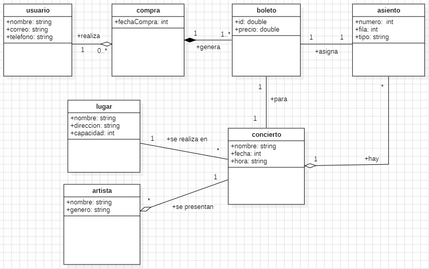

# sistema-venta-de-boleto-para-concierto
Sofia Diaz Benites

Clases del sistema

  - Usuario
  - Compra
  - Boleto
  - Asiento
  - Concierto
  - Lugar
  - Artista

Relaciones

  - Un usuario puede realizar varias compras.
  - Una compra genera uno o más boletos.
  - Cada boleto corresponde a un asiento.
  - Cada boleto pertenece a un concierto.
  - Un concierto tiene varios asientos.
  - Un concierto se realiza en un lugar.
  - Un concierto puede tener uno o varios artistas.
